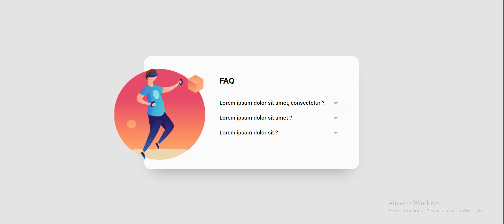

# Projeto acordeon

## 🪗 Um projeto com efeito acordeon

Um projeto simples com uma seção de perguntas frequentes com um efeito de acordeon que ao clicar numa pergunta a resposta deve aparecer e a outra pergunta que estiver aberta deve fechar.

## 💻 Design



## 🚀 Tecnologias utilizadas
- HTML
- CSS
- JavaScript

## 🔗 Clone o projeto
````
https://github.com/Ezequiel-Bomfim/projeto-acordeon.git
````
````
git@github.com:Ezequiel-Bomfim/projeto-acordeon.git
````

## 🗻 Desafios

Aqui irei citar alguns dos meus desafios

- Montar a estrutura HTML mais limpa possível.

- Como posicionar as setas.

- Fazer as respostas aparecerem.

## Coisas que aprendi

Nesse projeto consegui evoluir um pouco mais as minhas habilidades e maneiras de resolver problemas e aqui eu vou citar alguns deles.

- Aprendi mais uma forma de usar as imagens como backgroud.

- Aprendi a criar o efeito acordeon.

## 🎯 Desenvolvimento contínuo

Desejo avançar mais ainda no meu aprendizado e evoluir a cada desafio que me for proposto.

## 🙏 Agradecimentos

Quero agradecer a toda equipe do DevQuest por tirar minhas dúvidas e me fazer acreditar em mim mesmo. 